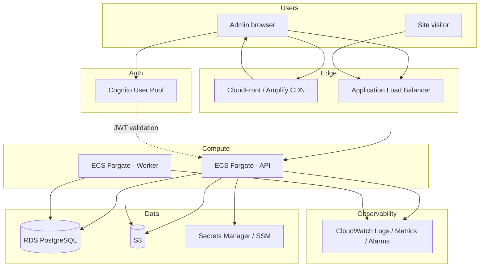

# AWS SaaS — engineering implementation plan

**Audience:** Engineering, DevOps, product.  
**Intent:** Ship a **small, shippable** AWS-based SaaS (V1), not a giant platform. This doc turns the architecture narrative into **buildable artifacts**: structure, boundaries, endpoints, infra modules, CI/CD, and milestones.

**One-line architecture:** **Amplify** hosts the web app; **ECS Fargate** runs API + worker; **RDS PostgreSQL** holds app data; **S3** holds uploads/assets; **Cognito** issues auth for the admin app; **ECR + GitHub Actions + CDK** deliver changes. Public widget traffic hits **ALB → ECS** (V1); add **API Gateway** later where throttling/partner APIs matter.

**Current codebase note:** The repo today uses **Next.js (App Router)**, **NextAuth**, and a **single deployable** with API routes. Treat that as **Phase A — product on one host**. The sections below describe the **target AWS decomposition** and migration path so you can adopt it incrementally (e.g. keep Next on Amplify first, move API to ECS when load or team boundaries require it).

---

## 1. V1 product scope (what we actually build)

### Admin (authenticated)

- Sign in, workspace context, settings shell  
- Create/list/manage **clients / businesses**  
- Upload **knowledge** (files + metadata)  
- Copy / install **website widget**  
- **Conversations** inbox + thread view  
- **Leads** and **contacts** (lightweight CRM)  
- **Automations** (rules/toggles, V1-simple)  
- **Analytics** summary (+ basic trends when ready)  
- **Team / workspace** (invites, roles — as implemented)

### Public widget

- Load embed on merchant site  
- Create session, send messages  
- Call **public chat APIs**  
- Persist messages, handoff, lead/contact side-effects  

That is sufficient for a credible first SaaS version.

---

## 2. System diagram

### 2.1 Logical (V1 target)



### 2.2 Request paths (summary)

| Path | Flow |
|------|------|
| Admin UI | Browser → Amplify CDN → Next/static assets → Cognito login → API calls with JWT → ALB → ECS API |
| Widget | Merchant page → widget JS (CDN/S3) → `POST` public endpoints → ALB → ECS API → RDS |
| Async | Upload / events → S3 + SQS (later) → Worker → RDS + optional notifications |

---

## 3. Recommended monorepo folder structure

Use **one repo** for a small team; split apps when deploys diverge.

```
repo/
├── apps/
│   ├── web/                 # Next.js (marketing + app) — Amplify
│   ├── api/                 # HTTP API service (Node/TS or Fastify/Nest) — ECS
│   └── worker/              # Background jobs — ECS
├── packages/
│   ├── shared/              # Types, zod schemas, constants
│   ├── db/                  # Drizzle/Prisma schema, migrations
│   └── ui/                  # Optional shared UI for admin
├── infra/
│   └── cdk/                 # VPC, ECS, RDS, Cognito, S3, ALB, IAM
├── .github/
│   └── workflows/           # amplify.yml or separate workflows
└── docs/
    ├── engineering-aws-saas-implementation.md   # this file
    └── ...
```

**Migration from current repo:** Start by moving **only** `infra/` and **CI**; keep `src/` as `apps/web` when you split. Alternatively keep a single Next app on Amplify and extract `apps/api` when API routes become a bottleneck.

---

## 4. Service boundaries (V1: one deploy, clear modules)

Deploy **one API container** initially; enforce boundaries in code.

| Module | Responsibility |
|--------|----------------|
| `auth` | JWT validation (Cognito JWKS), workspace membership, roles |
| `workspaces` | Org/workspace CRUD, billing hooks later |
| `users` | Profile, invites (later) |
| `clients` | Businesses/brands, widget public ID |
| `widget` | Public config/session/chat by `publicId` |
| `conversations` | Threads, messages, handoff, status |
| `contacts` | Directory derived from chats |
| `leads` | Pipeline, rules, extraction |
| `knowledge` | Metadata, upload URLs, processing status |
| `automations` | Rules CRUD, toggles |
| `analytics` | Aggregates, time series |
| `integrations` | WhatsApp/webhooks (phase in) |
| `notifications` | Email/WhatsApp templates, dispatch |
| `billing` | Stripe or future — stub in V1 |

**Worker** owns: document chunking, embedding/index jobs, aggregation jobs, retries, scheduled tasks.

---

## 5. Endpoint catalog (product-aligned)

Names follow REST style; your current Next routes may differ — map during migration.

### 5.1 Auth & session

| Method | Path | Notes |
|--------|------|--------|
| — | Cognito Hosted UI / SDK | Login, refresh |
| `GET` | `/me` | User + workspace claims |
| `GET` | `/workspace` | Workspace settings |
| `PATCH` | `/workspace` | Update name, prefs |

### 5.2 Clients (businesses)

| Method | Path | Notes |
|--------|------|--------|
| `GET` | `/clients` | List |
| `POST` | `/clients` | Create + `widgetPublicId` |
| `GET` | `/clients/:id` | Detail |
| `PATCH` | `/clients/:id` | Update |

### 5.3 Public widget (unauthenticated + rate limit)

| Method | Path | Notes |
|--------|------|--------|
| `GET` | `/public/widget/:publicId/config` | Branding, allowed origins |
| `POST` | `/public/widget/:publicId/session` | Start session |
| `POST` | `/public/widget/:publicId/chat` | Send message (aligns with current pattern) |

*Current repo:* `GET/POST` under `app/api/public/widget/...` — preserve contract for widget embeds.

### 5.4 Conversations

| Method | Path | Notes |
|--------|------|--------|
| `GET` | `/conversations` | List + filters |
| `GET` | `/conversations/:id` | Messages |
| `PATCH` | `/conversations/:id` | Status, assignee, handoff |

### 5.5 Contacts & leads

| Method | Path | Notes |
|--------|------|--------|
| `GET` | `/contacts` | List |
| `GET` | `/leads` | List |
| `POST` | `/leads` | Manual create |
| `PATCH` | `/leads/:id` | Status, owner |

### 5.6 Knowledge

| Method | Path | Notes |
|--------|------|--------|
| `POST` | `/clients/:id/knowledge/upload` | Presigned URL or multipart |
| `GET` | `/clients/:id/knowledge` | Documents + status |
| `DELETE` | `/knowledge/:id` | Soft delete |

### 5.7 Automations & analytics

| Method | Path | Notes |
|--------|------|--------|
| `GET` | `/automations` | List rules |
| `PATCH` | `/automations/:id` | Enable/configure |
| `GET` | `/analytics/summary` | KPIs |
| `GET` | `/analytics/timeseries` | Charts (when ready) |

### 5.8 Webhooks (phase in)

| Method | Path | Notes |
|--------|------|--------|
| `POST` | `/webhooks/whatsapp` | Verify + enqueue |

---

## 6. AWS infrastructure modules (CDK buckets)

Implement as **stacks** or **constructs** (TypeScript CDK suggested if the team is TS-heavy).

| Module | AWS resources |
|--------|----------------|
| **Network** | VPC, public/private subnets, NAT (if private egress needed), SGs |
| **Edge** | ALB, ACM cert, Route 53 records (`api.`, `app.`) |
| **Compute** | ECS cluster, Fargate services (API, worker), task definitions, auto scaling |
| **Auth** | Cognito User Pool, app clients (web), optional identity pool later |
| **Data** | RDS PostgreSQL (Multi-AZ prod later), subnet groups, backups |
| **Storage** | S3 buckets (uploads, widget assets), encryption, lifecycle |
| **Queue** | SQS queues for worker (optional V1 if worker only polls DB) |
| **Secrets** | Secrets Manager or SSM for DB URL, API keys, Cognito client secret |
| **Registry** | ECR repositories for `api`, `worker` images |
| **Observability** | Log groups, metric filters, alarms (5xx, CPU, memory) |
| **Frontend** | Amplify app linked to GitHub, branch previews, env vars |

**V1 simplification:** Single ALB listener rule to ECS API; worker has no public ingress.

---

## 7. CI/CD plan

### 7.1 Frontend (Amplify)

- Connect GitHub repo; set **build spec** to `cd apps/web && npm ci && npm run build` (or root if monorepo not split yet).  
- Branches: `main` → prod, `develop` → staging, PRs → **preview** URLs.  
- Env vars per branch: `NEXT_PUBLIC_*`, API base URL, Cognito pool IDs.

**Amplify** `amplify.yml` (sketch):

```yaml
version: 1
applications:
  - appRoot: apps/web
    frontend:
      phases:
        preBuild:
          commands:
            - npm ci
        build:
          commands:
            - npm run build
      artifacts:
        baseDirectory: .next
        files:
          - '**/*'
      cache:
        paths:
          - node_modules/**/*
```

*Adjust `appRoot` if the app stays at repo root (`appRoot: .`).*

### 7.2 Backend API (GitHub Actions)

**Triggers:** push/PR to `apps/api/**`, `packages/**`, `infra/**` (optional).

**Stages:** install → lint → test → `docker build` → push **ECR** → ECS **deploy** (force new deployment or CodeDeploy).

**Sketch:** `.github/workflows/api.yml`

```yaml
name: api
on:
  push:
    branches: [main, develop]
    paths: ['apps/api/**', 'packages/**']
  pull_request:
    paths: ['apps/api/**', 'packages/**']

jobs:
  build:
    runs-on: ubuntu-latest
    steps:
      - uses: actions/checkout@v4
      - uses: actions/setup-node@v4
        with:
          node-version: '20'
          cache: 'npm'
      - run: npm ci
      - run: npm run lint -w apps/api
      - run: npm run test -w apps/api
      - name: Configure AWS credentials
        uses: aws-actions/configure-aws-credentials@v4
        with:
          aws-region: ${{ secrets.AWS_REGION }}
          role-to-assume: ${{ secrets.AWS_ROLE_ARN }}
      - name: Login to ECR
        uses: aws-actions/amazon-ecr-login@v2
      - name: Build and push
        run: |
          docker build -t $ECR_REGISTRY/chatbot-api:$GITHUB_SHA -f apps/api/Dockerfile .
          docker push $ECR_REGISTRY/chatbot-api:$GITHUB_SHA
      - name: Deploy ECS
        if: github.ref == 'refs/heads/main'
        run: |
          aws ecs update-service --cluster prod --service api --force-new-deployment
```

*Replace cluster/service names; use OIDC to AWS instead of long-lived keys when possible.*

### 7.3 Worker

Same pattern as API with path filters on `apps/worker/**` and a second ECR repo + ECS service.

### 7.4 Infra (CDK)

- Workflow: `cdk diff` on PR; `cdk deploy` on merge to `main` with **manual approval** for prod (GitHub Environments).

---

## 8. Security baseline (non-negotiables)

| Area | Practice |
|------|----------|
| Auth | Cognito JWT; API validates issuer, audience, expiry; workspace scoping on every query |
| Secrets | Secrets Manager / SSM; no secrets in Git |
| Network | RDS in private subnets; ECS tasks private; ALB only public entry for HTTP |
| Widget | Rate limit public routes; validate `publicId`; strict CORS for known origins |
| Files | Presigned uploads; size/type limits; virus scan later |
| Audit | Log admin mutations (later: append-only audit table) |

---

## 9. Observability baseline

- **Logs:** JSON structured logs; `requestId`, `workspaceId`, `conversationId` where applicable.  
- **Metrics:** ALB + ECS + RDS CloudWatch metrics; custom: widget sessions, messages, handoffs.  
- **Alarms:** ALB 5xx, ECS task health, RDS connections, queue age (when SQS exists).

---

## 10. Environments

| Env | Purpose | Rules |
|-----|---------|--------|
| `dev` | Fast iteration | May share reduced RDS; still separate Cognito app client recommended |
| `staging` | Pre-prod | Parity with prod topology |
| `prod` | Customers | Separate RDS, secrets, Cognito pool/clients, S3 buckets or prefixes |

Do **not** share production databases or production Cognito pools with staging.

---

## 11. Phased engineering roadmap (aligned with your doc)

| Phase | Focus | Exit criteria |
|-------|--------|----------------|
| **0** | Accounts, VPC, ECS hello-world, Amplify deploy, Cognito pool, ALB + TLS, logging | Blank stack deploys; health check green |
| **1** | Cognito + `/me` + workspace; protected admin shell | User can log in and see workspace |
| **2** | Clients CRUD + widget public ID | Matches Phase 2 in product doc |
| **3** | Public widget session + chat + persistence | Widget works end-to-end |
| **4** | Conversations list/detail + filters | Ops-ready inbox |
| **5** | Contacts + leads | Business value visible |
| **6** | S3 upload + worker pipeline + knowledge status | Upload → indexed |
| **7** | Automations + notifications | Basic rules + one channel |
| **8** | Analytics + hardening + staging → prod | Launch-ready |

---

## 12. Milestone breakdown (by week — indicative)

Assumes **1–2 engineers**; adjust for capacity.

| Week | Deliverable |
|------|-------------|
| 1 | Repo layout; CDK VPC + ALB + empty ECS; Amplify connected; Cognito pool |
| 2 | API container + health route + RDS; GitHub Actions → ECR → ECS |
| 3 | Cognito hosted login; JWT middleware; `/me`, `/workspace` |
| 4 | Clients module + DB migrations; parity with current Clients UI |
| 5 | Public widget endpoints + rate limit; session + message persistence |
| 6 | Conversations API + admin UI wired; handoff flags |
| 7 | Leads/contacts models + minimal UI |
| 8 | S3 presign + worker job + knowledge status |
| 9 | Automations v1 + notification stub |
| 10 | Analytics aggregation; alarms; staging soak; prod cutover plan |

---

## 13. What to avoid in V1

- API Gateway + Lambda **everywhere** as the default (add Gateway only for specific public or partner surfaces).  
- Full microservices split before modular monolith proves insufficient.  
- Shared prod DB across environments.  
- Long-lived AWS keys in CI (prefer OIDC).

---

## 14. Relationship to existing docs

- **Product / UX:** `frontend-product-requirements.md`, `ux-page-rules.md`  
- **This doc:** **where** and **how** the system runs on AWS and **how** engineering phases map to deployable increments.

---

## 15. Next artifacts to produce (optional follow-ups)

1. **CDK app** skeleton (`infra/cdk`) with VPC + ALB + one Fargate service + RDS placeholder.  
2. **Decision record:** NextAuth vs Cognito-only timeline for the existing Next app.  
3. **OpenAPI** (or typed route manifest) generated from `packages/shared` schemas for widget + admin parity.

---

*Document version: 1.0 — AWS SaaS implementation plan for chatbot-platform V1.*
